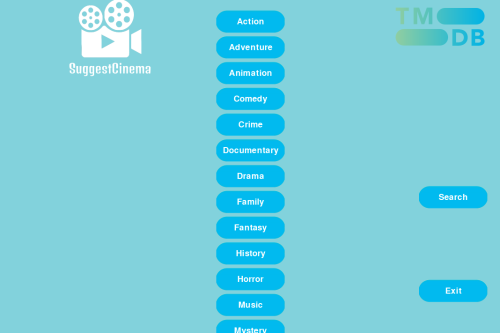
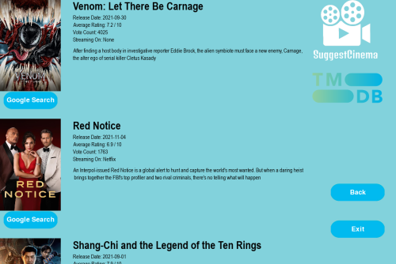
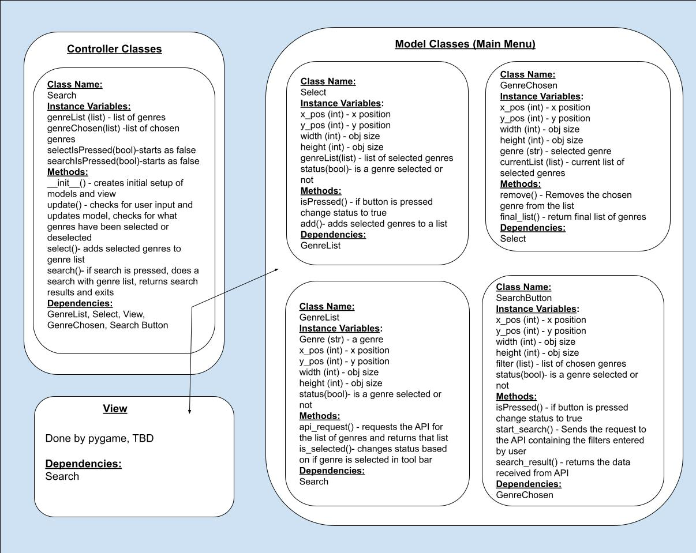
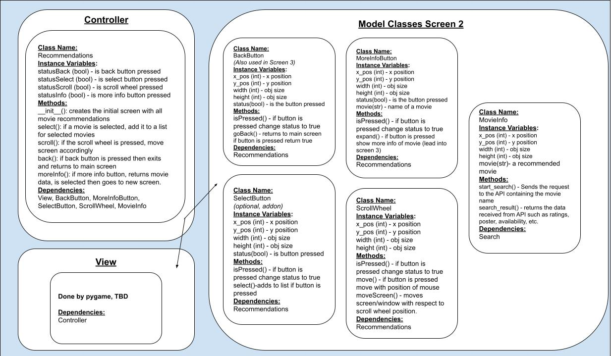
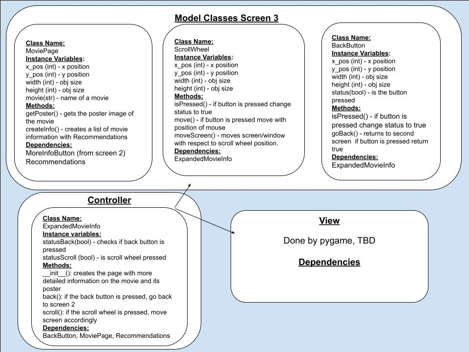
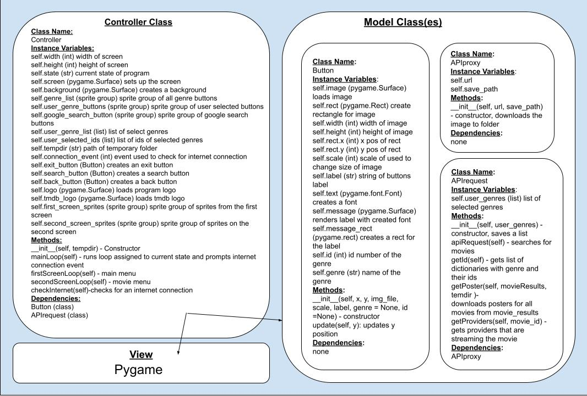

:warning: Everything between << >> needs to be replaced (remove << >> after replacing)
# CS110 Project Proposal
# Movie Recommender
## CS 110 Final Project
### Fall, 2021
### [Assignment Description](https://docs.google.com/document/d/1H4R6yLL7som1lglyXWZ04RvTp_RvRFCCBn6sqv-82ps/edit#)

[https://github.com/bucs110a0fall21/final-project-cinemadata](#)

[https://docs.google.com/presentation/d/1XLOuRfHVnA0BVwg9cgyn1Cj_gV2ZXaUWGFBF5htMWEg/edit?usp=sharing](#)

### Team: CinemaData
#### Daniel Zheng, Wilson Huang, Kevin Wu

***

## Project Description *(Software Lead)*
This is a program that takes user input based on genre and using selected genres, sends a request to the an API for 
films that have the genres chosen by the user. The user is able to select genres by pressing the buttons with the
respective genre on them, and can remove genres by clicking on the button that appears on the left. When the user has
made their selections, they can press the 'Search' button that then leads to A list of movies with matching genres are 
displayed with their posters, titles, and other relevant data.

***    

## User Interface Design *(Front End Specialist)*
* 
* Main Menu Screen
* Contains:
* Selection dropdown box
* Scrolling screen(scroll wheel is wish feature)
* Search button
* Remove button
* Selectable genres for the movie
* 
* Second Screen (Recommended movies)
* Contains:
* Poster for movies
* Back button
* Select button
* Scrolling screen
* More info button
* 
* Third Screen (Watchlist add-on)
* Contains:
* List of all the movies the user selected
* %20(1).png)
* Fourth Screen (More info screen)
* Contains:
* Information gathered from API about specific movie
* Also includes the previous back and scroll wheel

* Main Menu Screen
* Selection dropdown box
* Scrolling screen(scroll wheel is wish feature)
* Search button
* Remove button
* Selectable genres for the movie

* Second Screen (Recommended movies)
* Contains:
* Poster for movies
* Back button
* Exit Button
* Scrolling screen
* Google Search button
* Info on movies
***        

## Program Design *(Backend Specialist)*
### Old Program Design
* Non-Standard libraries
    * (pygame)
    * Pygame
        * Documentation:  https://www.pygame.org/docs/
        * This module is used to create the "view" or visuals of the project.
* Class Interface Design
    * Main Menu (Screen 1)
    
    * Search Results (Screen 2)
    
    * Movie Details (Screen 3)
    
* Classes
    * Main Menu
        * Models 
            * GenreList - creates a list of movie genres and determines their selection status
            * GenreChosen - list of selected genres and option to remove genre from list
            * Select - confirms selection of genres and add them to the list of selected genres
            * SearchButton - searches for movies based on selected genres
        * Controller
            * Search - creates the screen and determines what if a search can be made based on user input
        * View
            * Managed by pygame, TBD
    * Search Results (Screen 2)
        * Models 
            * BackButton - goes back to main menu
            * MoreInfoButton - changes screen to show more information on a movie (goes to screen 3)
            * SelectButton - adds movie to movie list
            * ScrollWheel - changes position of screen based on user input
            * MovieInfo - gets movie information for all recommended movies
        * Controller
            * Recommendations - creates screen 2 and determines if buttons are pressed, calls certain class methods depending on the button pressed
        * View
            * Managed by pygame, TBD
    * More Info Screen (Screen 3)
        * Models 
            * MoviePage - detailed data of selected movie
            * ScrollWheel - (same as screen 2)
            * BackButton - goes back to screen 2
        * Controller
            * ExpandedMovieInfo - creates page with movie's rating, description, poster, availability, etc. and checks to see if back button or scroll wheel are pressed
        * View
            * Managed by pygame, TBD
### Updated Program Design
* Non-Standard libraries
    * pygame
        * Documentation: https://www.pygame.org/docs/
        * This library is used to create the "view" or visuals of the project.
    * requests
        * Documentation: https://docs.python-requests.org/en/latest/user/quickstart/
        * This library is used to make API requests to get movie data
* Class Interface Design
    
* Classes
    * Model
        * Button
            * Creates button objects that stores data and has an update method that can be used to update its position.
        * APIrequests
            * Used to get data from a movie API and conduct searches with user input received from the controller.
        * APIproxy
            * Used by APIrequests to download images into a temporary folder/directory.
    * Controller
        * Controller(class)
            * Checks for events and uses the model and view to respond to them. Also checks for internet connection occasionally and exits the program is there is no connection.
    * View
        * pygame
            * Used to create the visuals
*** 

## Project Structure *(Software Lead)*

The Project is broken down into the following file structure:
* main.py
* src
    * APIproxy.py
    * APIrequest.py
    * Button.py
    * Controller.py
* assets
    * buttonicon.png
    * tmdblogo.png
    * screenlogo.png
* etc
    * foldercontents.txt
    * genrebutton.png
    * moviedb.png
    * searchbutton.png
    * selectbutton.png
    * UI.png
    * UI2.png
    * Class_screen_1.jpg
***

## Tasks and Responsibilities *(Software Lead)*
* You must outline the team member roles and who was responsible for each class/method, both individual and collaborative.

### Software Lead - Kevin Wu

Integrated the button and APIrequest models into the GUI, completed scrolling feature, caught various bugs that came up 
during the development process, cleaned up code, worked with back end and was responsible for integrating the models 
into the GUI for the first and second screens.

### Front End Specialist - Wilson Huang

Created controller class, set up the first and second screen loops, and worked with the back end specialist to integrate 
models into the GUI.

### Back End Specialist - Daniel Zheng

Created the Button, APIrequest, and APIproxy classes and methods within them. Worked with front end and software lead
to implement models into GUI.

## Testing *(Software Lead)*
* Tested code each time a new feature was added and tested all features, so long as they were implemented, as per the ATP.
    * Example: Tested 'Exit' button prior to scrolling feature as scrolling feature had yet to been implemented, and tested 'Search' button by printing out data prior to second screen being implemented. In addition, code was tested to ensure that user input would not break the program.

* Your ATP

| Step                  | Procedure     | Expected Results  | Actual Results |
| ----------------------|:-------------:| -----------------:| -------------- |
|  1  | Open terminal, navigate to folder, and type 'python main.py' | Program starts and displays main screen |    |
|  2  | Hover mouse over program window and mousewheel down in main screen |  Genre buttons in center move down  |    |
|  3  | Hover mouse over program window and mousewheel up in main screen | Genre buttons in center move up  |    |
|  4  | Left click on center button(s) with genres in main screen  | Button appears on the left with respective genre, indicating genre is added to selection |    |
|  5  | Left click on button(s) with selected genre(s) on the left in main screen | Button disappears, indicating that genre has been removed from selection |    |
|  6  | Left click on 'Search' button in the bottom right, above the 'Exit' button  | Window changes to different screen showing list of movies with matching genres  |    |
|  7  | Hover mouse over program window and mousewheel down in second screen  |  List of movies in center move down  |    |
|  8  | Hover mouse over program window and mousewheel up in second screen  |  List of movies in center move up  |    |
|  9  | Left click on a 'Google Search' button on the left, located below each movie poster |  Web browser opens with a Google search searching for the name of the movie directly above the button  |    |
|  10  | Left click on 'Back' button in the bottom right, above the 'Exit' button  |  Returns to previous screen  |    |
|  11  | Left click on 'Exit' Button in the bottom right  |  Program closes  |    |